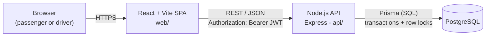
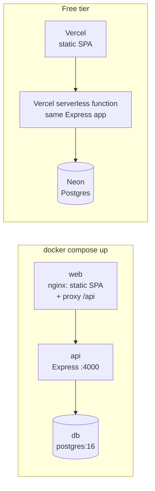
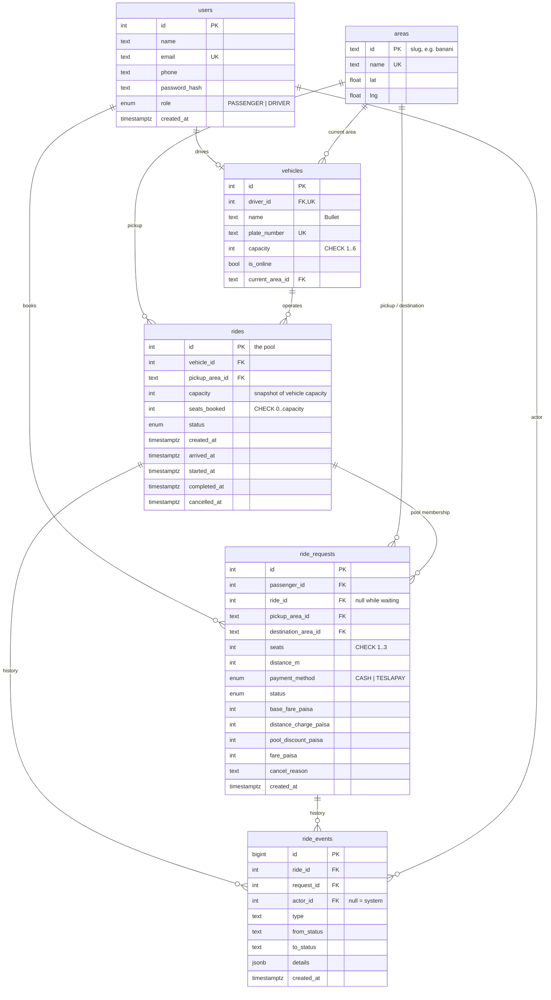

# Architecture

This document was written before the implementation and is kept in sync with it.
The domain rules (matching, fares, lifecycle) are in [domain.md](domain.md).

## 1. System overview



| Layer | What runs there | Responsibility |
| --- | --- | --- |
| Browser | The SPA bundle | Screens for passengers and the driver; polls the API every few seconds for status changes |
| Web (`web/`) | React 19 + Vite + React Router, plain CSS | Routing, forms, loading/error/empty states. **No business rules** - it only displays what the API returns |
| API (`api/`) | Node.js 20, Express 5 | Auth, validation, fare calculation, matching, seat claiming, state transitions, audit log |
| Database | PostgreSQL 16 | Source of truth. Constraints (CHECK, partial unique indexes, FKs) back up every rule the API enforces |

There is deliberately **one** API process and **one** database. No Redis, queues or
websockets: the MVP has one driver and a handful of passengers, and every piece of shared
state (seats, statuses) lives in Postgres where a transaction can protect it. Live updates
use polling (every 4 s) instead of websockets - see "Trade-offs" below.

## 2. Deployment view



In Docker, the `api` image runs migrations and the (idempotent) seed on start, so a fresh
database is always usable. On Vercel, the same Express app is exported from
`api/api/index.js` as a serverless function and migrations run during the build.

## 3. API layering

```
routes      ->  HTTP only: parse, validate (zod), call a service, shape the JSON
services    ->  use cases: open a transaction, lock rows, apply domain rules, write events
domain      ->  pure functions, no I/O: fare, distance, matching, state machine
prisma      ->  database access
```

Keeping the domain rules as pure functions means the fare and matching tests need no
database, and the evaluator can read the whole rule in one file.

## 4. Database (ERD)



### Why each table exists

| Table | Why |
| --- | --- |
| `users` | One table for both roles; `role` decides which endpoints a token can use. Drivers are seeded (the brief only gives passengers a sign-up flow). |
| `vehicles` | The Tesla and its **fixed capacity**. `driver_id` is unique: one driver, one vehicle. Online status and current area live here because they describe where the car is. |
| `areas` | The predefined list of Dhaka areas with a lat/lng point each. A table (not a hard-coded list) so requests can reference it with a foreign key. |
| `rides` | A **pool**: one trip of one Tesla that one or more requests share. Created when a driver accepts. `capacity` is copied from the vehicle so a later vehicle edit can't change a ride in progress. |
| `ride_requests` | One passenger's booking. `ride_id` **is** the pool membership - see below. Stores the fare breakdown so any fare can be re-explained later. |
| `ride_events` | Append-only history: every request, match, cancellation and status change, with who did it. Answers "what exactly happened?" after the fact. |

**Why no separate `pool_members` table?** A request belongs to at most one pool at a time.
A join table would allow a request to be in two pools, which is exactly the state we never
want. A nullable `ride_requests.ride_id` foreign key models "zero or one pool" directly.
Earlier memberships (e.g. after a driver cancels) are still visible in `ride_events`.

### Constraints that back up the business rules

| Rule | Enforced by |
| --- | --- |
| A ride never has more seats booked than its capacity | `CHECK (seats_booked BETWEEN 0 AND capacity)` on `rides` + row lock in the API |
| A passenger has at most one active request | Partial unique index on `ride_requests(passenger_id) WHERE status IN ('REQUESTED','MATCHED')` |
| A vehicle has at most one active ride | Partial unique index on `rides(vehicle_id) WHERE status IN ('ACCEPTED','DRIVER_ARRIVED','STARTED')` |
| Waiting requests have no ride; matched/completed ones do | `CHECK` on `ride_requests` tying `status` to `ride_id IS NULL` |
| Pickup and destination differ; seats 1-3; money never negative | `CHECK` constraints |
| Emails are unique | Unique index on `users(email)` |

Prisma's schema language cannot express CHECK constraints or partial indexes, so they are
written by hand in the SQL migration file.

### Indexes for the queries the app actually runs

- `ride_requests (status, pickup_area_id)` - the driver's feed of waiting requests in their area.
- `ride_requests (passenger_id, created_at)` - a passenger's history.
- `rides (status, pickup_area_id)` - finding an open pool to join.
- `ride_events (ride_id)`, `ride_events (request_id)` - history for one ride/request.

## 5. Concurrency: the last seat

Bullet has one seat left. Nusrat and Shirin press "Request" at the same moment and both
screens showed one free seat.

```mermaid
sequenceDiagram
    participant N as Nusrat's request
    participant S as Shirin's request
    participant DB as Postgres (rides row #7)

    N->>DB: BEGIN; SELECT ... FROM rides WHERE id=7 FOR UPDATE
    S->>DB: BEGIN; SELECT ... FROM rides WHERE id=7 FOR UPDATE
    Note over S,DB: blocks - row is locked by Nusrat's transaction
    N->>DB: seats_booked 2 + 1 <= 3 ✓ UPDATE seats_booked = 3, insert membership
    N->>DB: COMMIT (lock released)
    DB-->>S: lock granted, reads seats_booked = 3
    S->>DB: 3 + 1 > 3 ✗ no seat - skip this pool
    S->>DB: COMMIT (Shirin stays REQUESTED, waiting for another Tesla)
```

1. Every seat claim runs inside a transaction that first takes a **row lock** on the ride
   (`SELECT ... FOR UPDATE`). The second transaction waits, then reads the *committed*
   value, so it can never act on the stale "one seat left".
2. The `CHECK (seats_booked <= capacity)` constraint is a safety net: even a future code
   path that forgets the lock cannot commit an overbooked ride - the database rejects it.
3. When a request could join several pools, candidates are locked in ascending `id` order so
   two transactions can't lock the same two rides in opposite order (deadlock).

**At larger scale**: one hot row per ride is fine (a ride has at most a few seats), but the
matching query would move to a geospatial index (PostGIS) and a dedicated matching service
partitioned by area, so two requests for the same area are serialised by the partition
rather than by row locks. See [scaling.md](scaling.md).

## 6. Trade-offs

| Decision | Why | What would change it |
| --- | --- | --- |
| Polling every 4 s instead of websockets | No extra infrastructure; statuses change a few times per ride | Hundreds of concurrent riders per driver, or sub-second updates needed -> Server-Sent Events / websockets |
| JWT in `localStorage`, sent as a Bearer header | Works across the two Vercel domains (web and API) without third-party cookies | Any rich user-generated content (XSS risk) -> httpOnly cookie behind a same-origin proxy |
| Straight-line distances between area centres | The brief says not to fight map APIs; distances are reproducible by hand | Real routing -> OSRM / a maps API, storing the route distance on the request |
| Integer IDs | Simple, readable in demos and logs | Public, enumerable IDs become a concern -> UUIDs |
