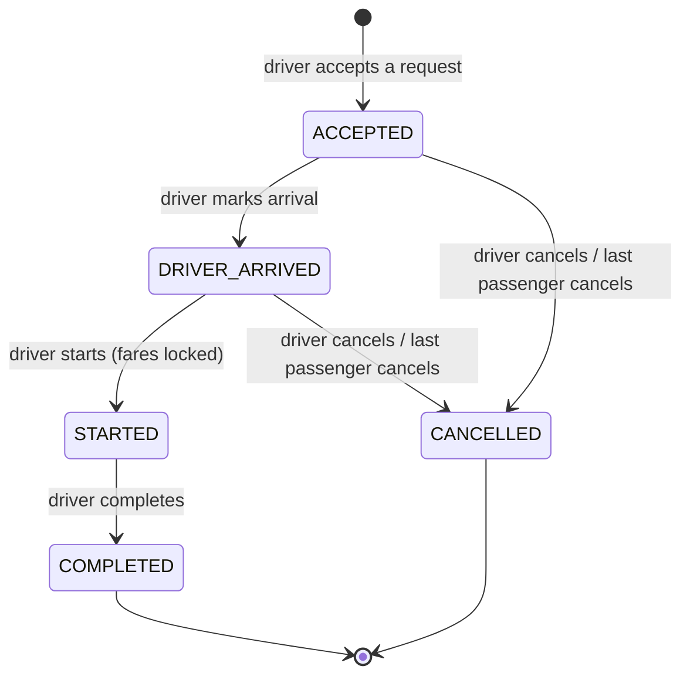
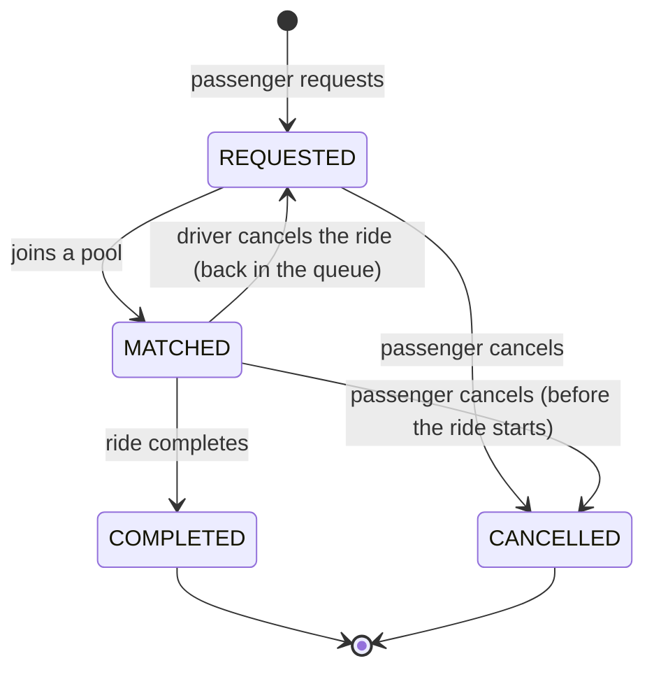

# Domain rules

Everything here is implemented as pure functions in `api/src/domain/` and covered by unit
tests, so the numbers in this document are the numbers the app produces.

## 1. The cast

| Who | Role | Notes |
| --- | --- | --- |
| Jashim | Driver | Owns **Bullet**, a three-seat, battery-powered, entirely unaffiliated "Tesla" (plate `DHAKA-METRO-THA-11-2024`) |
| Nusrat | Passenger | Banani -> Mohakhali, already late |
| Rafiq | Passenger | Banani -> Gulshan 1, two minutes after Nusrat |
| Shirin | Passenger | Tries for the last seat thirty seconds later |

## 2. Geography

A fixed list of Dhaka areas, each with one lat/lng point (roughly the centre of the area):

| id | Area | lat | lng |
| --- | --- | --- | --- |
| `uttara` | Uttara | 23.8759 | 90.3795 |
| `bashundhara` | Bashundhara | 23.8193 | 90.4526 |
| `mirpur` | Mirpur | 23.8223 | 90.3654 |
| `banani` | Banani | 23.7937 | 90.4066 |
| `gulshan-2` | Gulshan 2 | 23.7949 | 90.4143 |
| `gulshan-1` | Gulshan 1 | 23.7806 | 90.4163 |
| `mohakhali` | Mohakhali | 23.7781 | 90.4000 |
| `badda` | Badda | 23.7806 | 90.4262 |
| `tejgaon` | Tejgaon | 23.7639 | 90.3925 |
| `farmgate` | Farmgate | 23.7577 | 90.3897 |
| `dhanmondi` | Dhanmondi | 23.7461 | 90.3742 |
| `motijheel` | Motijheel | 23.7330 | 90.4172 |

**Distance** = straight-line (haversine) distance between the two points, **rounded to the
nearest 100 m**. No road network. Rounding keeps fares easy to check by hand.

| Trip | Distance |
| --- | --- |
| Banani -> Mohakhali (Nusrat) | 1,900 m |
| Banani -> Gulshan 1 (Rafiq) | 1,800 m |
| Mohakhali <-> Gulshan 1 (between their destinations) | 1,700 m |
| Banani -> Farmgate | 4,400 m |
| Banani -> Uttara | 9,500 m |

## 3. Matching rule

A new request can join an existing pool (ride) when **all** of these hold:

1. **Same pickup area** as the pool. Bullet picks everyone up in one place.
2. **Compatible destinations**: the new destination is within **2,000 m** of *every*
   destination already in the pool. This keeps the drop-offs in one cluster, so nobody's
   ride turns into a tour of Dhaka.
3. **Seats**: `seats_booked + requested seats <= capacity`.
4. **Not started**: the pool is `ACCEPTED` or `DRIVER_ARRIVED`. Once the Tesla leaves, the
   pool is closed.

Applied to the story: Nusrat (-> Mohakhali) is in Jashim's pool. Rafiq requests Banani ->
Gulshan 1. Same pickup (Banani) ✓; Gulshan 1 is 1,700 m from Mohakhali (<= 2,000) ✓; seats
1 + 1 <= 3 ✓; pool not started ✓ -> **Rafiq joins Nusrat in Bullet.** A request for Banani
-> Uttara would not match (Uttara is ~8 km from Mohakhali), so it waits for another driver.

When several pools qualify, the oldest one is tried first (it has been waiting longest).

Two ways into a pool, both using the same rule and the same locked seat claim:

- **Automatic**: when a passenger creates a request, the API tries to place it in an open pool.
- **Driver**: Jashim sees waiting requests in his area and accepts one. If he has no active
  ride, this creates a new pool; if he does, the request is added to it (only if it matches).

## 4. Fare model

All money is stored as **integer paisa** (1 taka = 100 paisa) in `INTEGER` columns.
Floating point cannot represent values like 0.1 exactly, so `0.1 + 0.2 !== 0.3` in
JavaScript. Integer paisa has no rounding drift, sums exactly, and is what payment systems
use. The UI divides by 100 only when displaying.

```
subtotal       = (baseFare + distanceCharge) x seats
distanceCharge = distance_m x 3 paisa            (= ৳30 per km)
baseFare       = 5,000 paisa                     (= ৳50)
poolDiscount   = floor(subtotal x 25 / 100)      only if the ride is shared
fare           = subtotal - poolDiscount
```

"Shared" means at least **two different passengers' requests** are in the ride when it
**starts**. The fare is locked at `STARTED`, because that is the moment pool membership can
no longer change. Before that, the passenger sees an estimate for both cases.

### Worked example: Nusrat and Rafiq share Bullet

| | Nusrat (Banani -> Mohakhali) | Rafiq (Banani -> Gulshan 1) |
| --- | --- | --- |
| Distance | 1,900 m | 1,800 m |
| Distance charge | 1,900 x 3 = 5,700 | 1,800 x 3 = 5,400 |
| Base fare | 5,000 | 5,000 |
| Subtotal (1 seat) | 10,700 | 10,400 |
| Pool discount 25% | 2,675 | 2,600 |
| **Fare** | **8,025 paisa = ৳80.25** | **7,800 paisa = ৳78.00** |
| If they had ridden alone | ৳107.00 | ৳104.00 |

Each passenger sees only their own fare. Jashim sees all fares in his ride (৳158.25 total).

**Payment**: `CASH` or simulated `TESLAPAY`. No gateway; the request records the method
and is marked paid when the ride completes.

## 5. Lifecycle

The brief suggests a single lifecycle `REQUESTED -> MATCHED/ACCEPTED -> DRIVER_ARRIVED ->
STARTED -> COMPLETED (+ CANCELLED)`. In a *pool*, one status on one row is not enough:
Nusrat can cancel while Rafiq's ride continues. So there are two state machines:

- the **ride** (the Tesla's trip, shared) and
- each **request** (one passenger's booking).

### Ride (pool)



### Request (passenger booking)



Any transition not drawn above is rejected with `409 INVALID_TRANSITION` (e.g. completing
a ride that never started, or starting it twice).

### What the passenger sees

The passenger screen shows one simple status derived from both machines, matching the
brief's `waiting -> matched -> in progress -> completed/cancelled`:

| Request | Ride | Passenger sees |
| --- | --- | --- |
| REQUESTED | - | Waiting for a Tesla |
| MATCHED | ACCEPTED | Matched |
| MATCHED | DRIVER_ARRIVED | Driver arrived |
| MATCHED | STARTED | In progress |
| COMPLETED | COMPLETED | Completed |
| CANCELLED | any | Cancelled |

### Cancellation rules

| Who | When | Effect |
| --- | --- | --- |
| Passenger | `REQUESTED` | Request cancelled |
| Passenger | `MATCHED`, ride not started | Request cancelled, seats released; if nobody is left, the ride is cancelled too |
| Passenger | ride `STARTED` or later | Rejected (`409`) - you're already in the car |
| Driver | ride `ACCEPTED` / `DRIVER_ARRIVED` | Ride cancelled; every passenger goes back to `REQUESTED` so another Tesla can take them |
| Driver | ride `STARTED` or later | Rejected (`409`) |

### Other rules

- A passenger has at most one active (`REQUESTED` / `MATCHED`) request.
- A driver must be **online** to accept, and can't go offline with an active ride.
- A driver has at most one active ride.
- A ride can't start with nobody in it.
- Passengers can only see and change their own requests. They see how many people share
  the ride, never who or what they pay.

## 6. Assumptions

- **One pickup point per pool.** Everyone is collected in the same area; only drop-offs
  differ. Multi-pickup routing is out of scope.
- **Joining is automatic.** Pooling is the point of the product, so a passenger who fits an
  open pool is placed there without asking the driver; the driver sees the new passenger on
  the next refresh. The driver can still decline to start (cancel) if something looks wrong.
- **Max 3 seats per request** (Bullet's full capacity).
- **Drivers are pre-registered.** The brief gives drivers "sign in" only; onboarding a
  driver and vehicle is an admin task outside the MVP.
- **No cancellation fees and no ratings.** Easy to add later (the fare breakdown and
  events already exist), but they don't change the core pooling problem.
