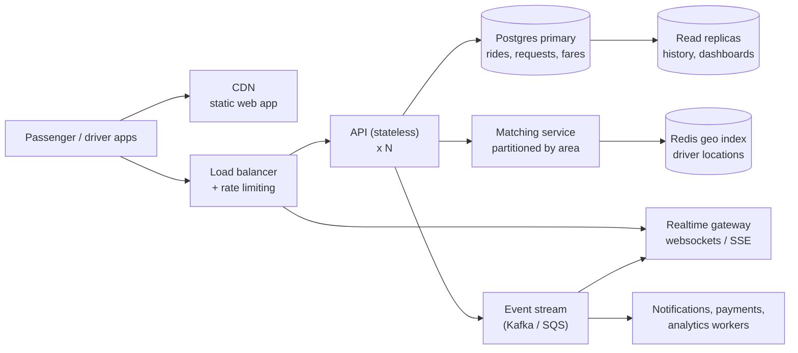

# Bonus: scaling Dhaka Tesla Pool ("If Oi Tesla goes viral")

What changes at **1M passengers and 100k drivers**, and what doesn't. None of this is built -
the MVP deliberately stays one API and one database (brief §9). This is the plan for when the
numbers force it, in the order it would likely be needed.

## Rough numbers first

- 100k drivers sending a location every 5 s = **20k writes/s** of location pings.
- Morning peak: say 10% of 1M passengers book within an hour = ~28 requests/s on average,
  bursting to a few hundred per second. Each request runs matching.
- Status polling: 100k active screens every 4 s = 25k reads/s - the first thing to replace.

The expensive part is not booking; it is **locations and live updates**. Ride and fare data
stay small and relational.

## Target architecture

## Area by area

| Concern | MVP today | At scale | Why / when |
| --- | --- | --- | --- |
| **Horizontal scaling** | One API process | Stateless API behind a load balancer, autoscaled on CPU/latency | The API already keeps no in-memory state (JWT auth, all state in Postgres), so this is "run more copies" |
| **Load balancing** | Render's router | L7 load balancer with health checks on `/api/health` | Health check already exists |
| **Database** | One Postgres | Primary for writes + read replicas for history/driver dashboards; connection pooling (PgBouncer) | Reads (history, polling) dominate writes. Replicas lag, so anything that decides seats must read the primary |
| **Indexing** | Composite indexes on status + area | Same, plus partitioning `ride_events` by month; archive completed rides | `ride_events` grows fastest and is append-only |
| **Geospatial search** | Fixed areas, straight-line distance | Driver locations in a Redis geo set (`GEOSEARCH` radius queries); PostGIS for stored routes; real road distance from OSRM | Areas become too coarse once there are thousands of drivers per area |
| **Matching** | Row lock per ride, inside the booking request | A matching service partitioned by area (or H3 cell): each partition processes its requests in order, so two requests for the same pool are serialised by the partition, not by fighting over a row lock | Row locks are fine for a few concurrent requests per ride; a hot area at peak would queue on them |
| **DB contention** | `SELECT ... FOR UPDATE` on one ride row | Keep the lock (it is short) but make it rare: partitioned matching means few transactions ever touch the same ride at once | The CHECK constraint stays as the last line of defence |
| **Caching** | None | Cache areas/fare rules (rarely change) in memory; cache driver dashboards for ~1 s | Never cache seat counts used for decisions |
| **Queues / events** | None; everything is synchronous | Write the event row and publish to a stream in the same transaction (transactional outbox). Consumers: push notifications, payments, analytics, realtime | Keeps the booking request fast and decouples side effects |
| **Real-time** | Polling every 4 s | Websockets / SSE gateway fed by the event stream; clients subscribe to "my ride" | Polling at 25k reads/s is pure waste |
| **Rate limiting** | Per-IP limit on login/sign-up | Per-user and per-IP limits at the gateway; stricter on booking and accept | Stops scripted booking and credential stuffing |
| **Idempotency** | One-active-request index makes double-booking impossible | `Idempotency-Key` header on booking/accept/transitions, stored with the result for 24 h | Mobile networks retry; the same tap must not create two bookings or two charges |
| **Retries / failure** | Transaction rolls back; client sees an error | Retry deadlocks/serialisation failures with jitter; circuit breakers around payment/map providers; outbox guarantees events are eventually published | Partial failure becomes normal with more services |
| **Observability** | Structured JSON logs with request ids | Centralised logs, metrics (p95 latency, match rate, time-to-match, overbooking attempts refused), tracing across API -> matching -> DB; alerts on error rate | You can't fix what you can't see |
| **Security** | JWT, bcrypt, helmet, CORS allow-list, validation, rate limit | Short-lived access + refresh tokens in httpOnly cookies, secrets in a manager, WAF, audit on admin actions, PII (phone numbers) encrypted and masked between riders | More users = more attackers and more regulation |
| **Deployment** | Render + Vercel from git | Containers on a managed orchestrator (ECS / Cloud Run), blue-green or canary releases, migrations that are backward compatible (expand -> migrate -> contract) | Zero-downtime deploys while rides are in progress |

## What I would *not* change

- **Postgres as the source of truth for rides, seats and money.** Seat counts and fares need
  transactions and constraints; that doesn't get less true with more users.
- **Integer paisa.**
- **The two state machines and the event log.** They are exactly what an event stream would
  publish.

## The order I'd do it in

1. Replace polling with SSE/websockets (biggest waste first).
2. Read replicas + PgBouncer.
3. Idempotency keys on booking and accept.
4. Redis geo index for driver locations; real routing distances.
5. Transactional outbox + event stream; move notifications/payments to workers.
6. Partitioned matching service once one area's peak load makes row locks queue.
